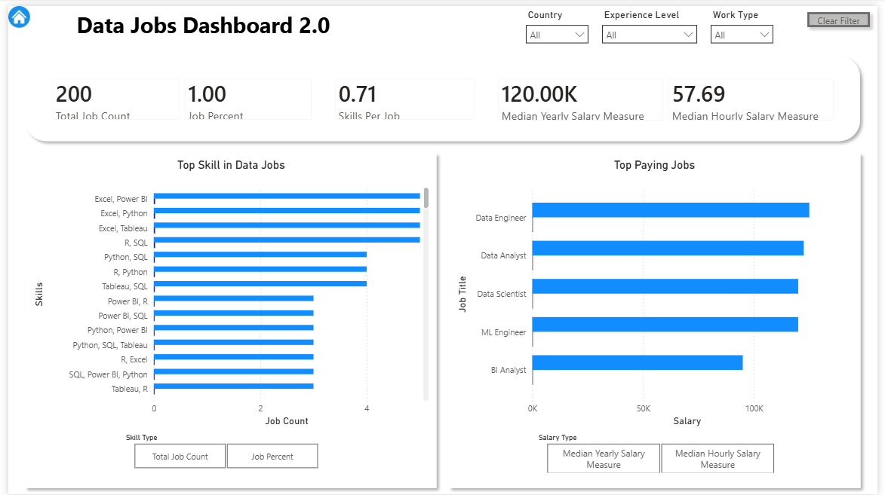
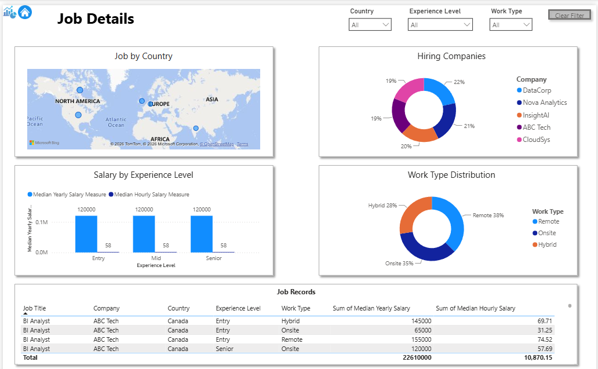

# 📊 Data Jobs Dashboard – Power BI Portfolio Project

An interactive Power BI dashboard built to analyze global data job trends, salaries, hiring companies, required skills, and work arrangements through business intelligence and data visualization.

---

# 📌 About the Project

The **Data Jobs Dashboard** is an end-to-end Power BI portfolio project developed to analyze the current data job market using interactive dashboards.

The project transforms raw job posting data into meaningful business insights, allowing users to explore:

- Salary trends
- In-demand technical skills
- Hiring companies
- Hiring countries
- Remote, Hybrid and On-site opportunities
- Experience level distribution

This project demonstrates a complete Business Intelligence workflow from data preparation to dashboard design.

---

# 🎯 Project Objectives

This dashboard helps answer important business questions such as:

- Which technical skills are most in demand?
- Which countries have the highest number of job postings?
- Which companies are hiring the most?
- How does salary vary by experience level?
- Which work arrangements are most common?

---

# 🛠️ Tools & Technologies

- Microsoft Power BI
- Power Query
- DAX (Data Analysis Expressions)
- Microsoft Excel
- Data Visualization
- Data Cleaning
- Business Intelligence
- Git & GitHub

---

# 📂 Project Structure

```
Data-Jobs-Dashboard-Power-BI
│
├── Dataset
│   └── Data_Jobs_Dataset_200_Rows.xlsx
│
├── Images
│   ├── Home page.png
│   ├── Dashboard.png
│   ├── Job-details.png
│
├── Data jobs dashboard.pbix
│
└── README.md
```

---

# 📄 Dashboard Pages

## 🏠 Home Page

The Home Page acts as the landing page of the dashboard.

It provides:

- Project introduction
- Navigation buttons
- Dashboard overview
- Easy page navigation
- Clean and professional UI

### Screenshot


---

## 📈 Dashboard

The Dashboard page provides the main business insights.

Features include:

- KPI Cards
- Salary Analysis
- Skills Analysis
- Hiring Trends
- Interactive Filters
- Dynamic DAX Measures
- Business Insights

### Screenshot



---

## 📋 Job Details

The Job Details page contains detailed job posting information.

It includes:

- Country-wise hiring
- Top Hiring Companies
- Experience Level Analysis
- Work Type Distribution
- Detailed Job Table

### Screenshot



---

## Live Dashboard

> **Note:** This report was published to Power BI Service using an organizational Microsoft 365 account.

Due to organizational security policies, public sharing ("Publish to web") is disabled by the tenant administrator. Therefore, a public live dashboard link cannot be provided.

The interactive report can be demonstrated during interviews or shared through authorized organizational access.

# ✨ Features

- Interactive multi-page dashboard
- Dynamic KPI Cards
- Power Query transformations
- DAX calculations
- Interactive slicers
- Navigation buttons
- Business-focused visualizations
- Professional dashboard design
- Clean user interface
- Responsive report layout

---

# 📊 Dataset

The dataset contains information about data-related job postings including:

- Job Title
- Company Name
- Country
- Salary
- Experience Level
- Required Skills
- Work Type
- Hiring Information

The dataset was cleaned and transformed using Power Query before building the dashboard.

---

# 💡 Key Insights

Using this dashboard, users can identify:

- Most in-demand skills
- Highest paying job roles
- Top hiring companies
- Hiring trends across countries
- Distribution of Remote, Hybrid and On-site jobs
- Experience level demand

---

# 🧠 Skills Demonstrated

## Data Preparation

- Data Cleaning
- Power Query
- Data Transformation

## Data Modeling

- Relationships
- Data Model Design

## DAX

- Measures
- Calculated Columns
- KPI Calculations
- Dynamic Metrics

## Visualization

- KPI Cards
- Charts
- Tables
- Maps
- Slicers
- Interactive Navigation

## Business Intelligence

- Dashboard Design
- Business Insights
- Storytelling with Data

---

# 📚 What I Learned

Through this project, I gained hands-on experience with:

- Building complete Power BI dashboards
- Cleaning real-world datasets
- Creating DAX measures
- Designing interactive reports
- Applying Business Intelligence concepts
- Building portfolio-ready analytics projects

---

# 🔮 Future Improvements

- Publish dashboard to Power BI Service
- Add real-time data refresh
- Expand dataset
- Add drill-through pages
- Improve mobile layout
- Add predictive analytics

---

# 👩‍💻 Author

**Ansila**

GitHub:

https://github.com/ansila-003

LinkedIn: https://www.linkedin.com/in/ansila-ansi

*(Add your LinkedIn profile here)*

---

⭐ If you found this project useful, consider giving it a star.
